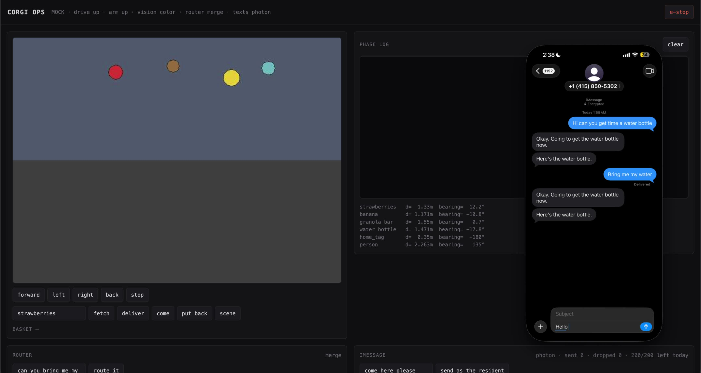

# Corgi

A robot you text. Ask for a water bottle, or ask it to walk with you — it answers
in the Messages app you already use.

**Photon iMessage • Merge Gateway routing • LeRobot SO-101 • Arduino drive base**

---

## Usecase

Getting up for a water bottle or pacing to the kitchen should not need a caregiver
standing by. Full autonomy still fails on the messy last 5% — a missed grasp, an
ambiguous object, an unsteady step — and today the fix is a person babysitting the
room. Corgi is an in-home helper you text in plain English. It finds an item, puts it
in its basket, drives back, and hands it over. Or it comes to you and keeps pace
beside you with the arm held out as something to steady a hand on. When a grasp fails,
it asks for a nudge instead of pretending it succeeded. One Mac holds the whole robot;
the same stack demos with nothing plugged in.

Walker mode is a paced escort, not a mobility aid. The base cannot take a person's
weight, and nothing here pretends otherwise.

---

## Features

### Text Sim → Simulation Backend
Type a request in the web phone. The same path a real iMessage hits routes the
intent, runs search → approach → grasp → stow → return → present on a simulated
robot, and replies with a short acknowledgement and a delivery text.

<p align="center">
  <a href="https://github.com/jerryli08/corgi-hackathon/releases/download/demo-media/text-sim-demo.mp4">
    
  </a>
</p>

https://github.com/jerryli08/corgi-hackathon/releases/download/demo-media/text-sim-demo.mp4

Re-record after a sim change:

```bash
CORGI_MOCK=1 CORGI_MESSAGING_BACKEND=log CORGI_ROUTER_BACKEND=keyword \
  ./scripts/run_server.sh
# other terminal
CORGI_BASE_URL=http://localhost:8000 python scripts/record_text_sim_demo.py
```

### iMessage Concierge
Photon (Spectrum) delivers inbound texts; replies go back to the same conversation.
Two texts per errand — acknowledgement, then arrival / delivery / help / failure —
so an elderly person never gets nine updates about one water bottle.

### Intent Router
Merge Gateway turns free text into one typed intent. A fast model handles the short
messages; a deeper model only runs when confidence is low. Every failure degrades to
an offline keyword router, and `stop` / `help` always win over the model.

### Fetch & Deliver
Visual servoing drives until the object sits on a calibrated sweet spot, then a
canned grasp runs. Missed grasps are detected from gripper travel, retried once, then
escalated as `NEEDS_HELP`. The item rides in the basket — not the jaws — on the way
home.

### Walk With Me
Dead-man paced escort: wheels move only while hold-to-drive instructions keep
arriving. Silence stops the base within `CORGI_WALK_DEADMAN_MS`. The arm holds a
handhold *reference*; it is not load-bearing.

### Ops Console
Live camera, phase log, router decisions, message log (including texts held back),
walker dead-man countdown, manual jog, e-stop, and simulator ground truth at
`/ops`.

### Deterministic Skills

| Skill / intent | What it does |
|---|---|
| `fetch` | Find → approach → grasp → stow → return → present |
| `come` | Drive beside the person and stop |
| `walk` | Come over, then dead-man paced escort |
| `stop` | Cancel the current skill / walker |
| `status` | Short report of what the robot is doing |
| `help` | Stop and say it cannot call anyone (honest) |

---

## How It's Made

| Layer | Stack |
|---|---|
| Transport | Photon Spectrum (iMessage), local `corgi/` bun bridge, or console log |
| Router | Merge Gateway (fast → deep) with keyword fallback |
| Skills | OpenCV / VLM perception, visual servo, SO-101 keyframes |
| Body | Arduino differential drive, Feetech STS3215 arm, USB camera |
| Host | One FastAPI process on a Mac (`python -m robot.server`) |

```text
iMessage (or web phone)
  → Photon / simulate
  → Concierge
  → Merge / keyword router → typed intent
  → skill state machine
  → drive + arm + camera
  → milestone texts only (ack, done / help / fail)

Camera frame
  → locate (color | VLM)
  → move-then-look servo loop
  → canned grasp at SWEET_SPOT
  → basket stow → return → present
```

---

## Project Status

### To-Do

- [ ] Hardware bring-up of drive + arm + camera on one USB hub
- [ ] Calibrated sweet-spot + grasp keyframes under demo lighting
- [ ] VLM perception path in the live demo (`CORGI_VISION_BACKEND=vlm`)
- [ ] Real Photon round-trip from a resident's phone
- [ ] Reliability block: `smoke.py 20` on hardware, not only mock
- [ ] Dataset / policy path for the grasp (see `docs/TRAINING_GRASP.md`)

### Finished

- [x] Single-process Mac host: orders, skills, camera, drive, arm, web
- [x] Mock world so the whole loop runs with nothing plugged in
- [x] Text sim UI + ops console with phase stream and ground truth
- [x] Photon bridge + webhook + AppleScript messaging backends
- [x] Merge Gateway router with keyword fallback and stop/help override
- [x] Fetch → basket → deliver skill machine with `NEEDS_HELP`
- [x] Dead-man walker mode with honest non-load-bearing copy
- [x] Dual watchdogs (host + Arduino firmware)
- [x] Smoke / walk / router / pytest suite

---

## Lessons Learned

- Keeping LLMs in the router role — typed intents only, never freeform motor commands
- Milestone texts beat phase spam when the reader is elderly
- Sweet-spot visual servoing beats estimated 3D pose for a one-camera, one-day demo
- Two independent watchdogs (host + firmware) cover late commands *and* a dead host
- Degrade, don't crash: missing camera, arm, key, or model must still boot the server
- Walker copy has to stay honest — paced escort, never "lean on"

---

## How to Run

### Requirements

- Python 3 and pip
- Optional: [Bun](https://bun.sh) for the Photon `corgi/` bridge
- Optional hardware: Arduino drive base, LeRobot SO-101, USB camera

### Step 1: Install

```bash
python3 -m venv .venv
source .venv/bin/activate
pip install -r requirements.txt
cp .env.example .env
```

### Step 2: Run with no hardware

```bash
CORGI_MOCK=1 ./scripts/run_server.sh
```

Open <http://localhost:8000> and text it. There is no phone in the loop — the page posts
to the same handler a real message hits.

```
bring me my water bottle
come here
walk with me
stop
```

Ops console: <http://localhost:8000/ops>

```bash
python scripts/smoke.py                 # one order, every phase
python scripts/smoke.py 20              # real success rate
python scripts/smoke.py 20 --fail 0.3   # exercise NEEDS_HELP
python scripts/smoke.py --via text      # in through the text path
python scripts/smoke_walk.py            # dead-man actually stops
python scripts/check_router.py          # what the router decides
pytest
```

### Step 3: Text it for real (Photon)

```bash
bun create spectrum-project@latest corgi \
  --projectId <your-project-id> --providers imessage --yes
cd corgi && bun start
```

Then set `CORGI_MESSAGING_BACKEND=photon` on the robot. Recipients must be phone
numbers. `CORGI_MESSAGING_BACKEND=applescript` is the no-account fallback (outbound
only through Messages.app on this Mac).

### Step 4: Hardware

1. Flash `firmware/drivebase/drivebase.ino`. `python scripts/check_devices.py` lists ports.
2. Start without `CORGI_MOCK`. Missing camera or arm degrades; `/api/health` says what came up.
3. Calibrate: `python scripts/calibrate.py water bottle` → set `CORGI_SWEET_SPOT_*` in `.env`.
4. `CORGI_ARM_ENABLED=1` once the SO-101 is bolted down; hand-pose keyframes in `robot/poses.py`.
5. Demo perception: `CORGI_VISION_BACKEND=vlm` plus the matching API key.

---

## Project Layout

```text
corgi-hackathon/
├── web/            # resident phone UI + ops console
├── robot/          # FastAPI host, skills, vision, walker, messaging, router
├── firmware/       # Arduino drivebase sketch (with failsafe watchdog)
├── scripts/        # smoke, calibrate, record demo, router check
├── tests/          # no-hardware pytest suite
├── docs/
│   ├── assets/     # README GIF / mp4 (text-sim-demo.*)
│   └── TRAINING_GRASP.md
├── datasets/       # recorded teleop / grasp data
└── corgi/          # Photon Spectrum bridge (gitignored scaffold)
```

Deeper docs:

- [SPEC.md](SPEC.md) — implementation contract
- [Grasp training notes](docs/TRAINING_GRASP.md)
- [`.env.example`](.env.example) — every tunable

---
